<a href="https://alejandrobrito.dev">
  
</a>

  &nbsp;
  &nbsp;
  &nbsp;
  

  Construyo piezas concretas que mueven una métrica concreta: SaaS, ERPs y agentes de IA. 
  <b>Sin maquetas, sin demos: software en producción.</b>

## ⚡ El dashboard

  
  

 

  

 

  

 

  <picture>
    <source media="(prefers-color-scheme: dark)" srcset="https://raw.githubusercontent.com/AleBrito124356/AleBrito124356/output/github-snake-dark.svg"/>
    
  </picture>

## 🚀 Productos en producción

  <a href="https://morph-zeta.vercel.app"></a>
  <a href="https://norden-iota.vercel.app"></a>

| Proyecto privado | Qué es |
|---|---|
| **SIMANLLA / FENIX** | ERP de mantenimiento y call-center para Elevadores Goldstar — React 19 · PHP · Fenris IA |
| **Card Control** | Control de tarjetas corporativas para Castro & Castro — Next.js · MySQL |
| **CUSTOUTP** | Sistema de gestión de incidencias para la UTP — Next.js · Supabase · Expo |

## 🤖 Open source — 47 repos de IA listos para ejecutar

Agentes de IA de todo tipo, RAG, fine-tuning, infraestructura de LLMs, automatización y plantillas.
Todo funciona con la **[API gratuita de NVIDIA NIM](https://build.nvidia.com)** (endpoint compatible con OpenAI) o modelos locales con Ollama.
Cada repo trae README con diagramas, licencia MIT, `.env.example` y código sin stubs.

  <a href="https://github.com/AleBrito124356/nim-agent-lab">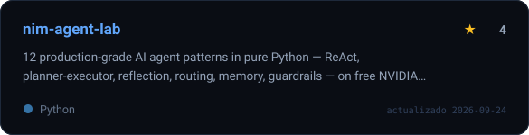</a>
  <a href="https://github.com/AleBrito124356/rag-blueprints">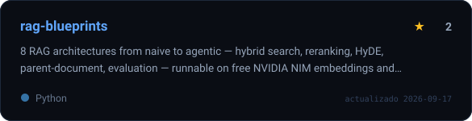</a>

  <a href="https://github.com/AleBrito124356/langgraph-agent-flows">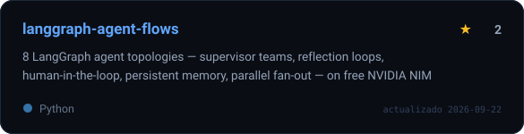</a>
  <a href="https://github.com/AleBrito124356/mcp-server-cookbook">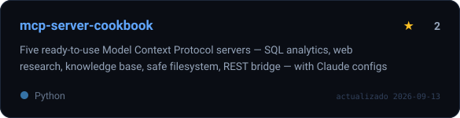</a>

  <a href="https://github.com/AleBrito124356/llm-eval-toolkit">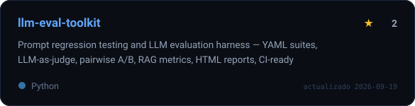</a>
  <a href="https://github.com/AleBrito124356/recetas-ia">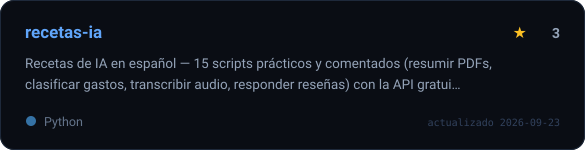</a>

<b>📚 Ver el catálogo completo — 47 repos por categoría</b>

 

#### Agentes de IA — patrones y frameworks

| Repo | Qué contiene |
|---|---|
| [nim-agent-lab](https://github.com/AleBrito124356/nim-agent-lab) | 12 patrones de agente en Python puro: ReAct, planner-executor, reflection, routing, memoria, guardrails |
| [langgraph-agent-flows](https://github.com/AleBrito124356/langgraph-agent-flows) | 8 topologías LangGraph: equipos supervisor, bucles de reflexión, human-in-the-loop, fan-out paralelo |
| [crewai-team-templates](https://github.com/AleBrito124356/crewai-team-templates) | 5 crews CrewAI listas: contenido, market research, documentación, auditoría SEO, lanzamiento |
| [agent-memory-systems](https://github.com/AleBrito124356/agent-memory-systems) | 5 arquitecturas de memoria para agentes (ventana, resumen, episódica vectorial, hechos, grafo) con benchmark |
| [agent-tools-library](https://github.com/AleBrito124356/agent-tools-library) | Librería de 25+ herramientas para agentes con schemas OpenAI, validación Pydantic y tests |
| [durable-agents](https://github.com/AleBrito124356/durable-agents) | Agentes de larga duración: cola SQLite, checkpointing, reanudación tras crash, gates de aprobación |
| [agent-security-toolkit](https://github.com/AleBrito124356/agent-security-toolkit) | Pruebas de seguridad para *tus* agentes: corpus de prompt-injection, runner con juez, guía de hardening |

#### Agentes aplicados — hacen un trabajo concreto

| Repo | Qué hace |
|---|---|
| [deep-research-agent](https://github.com/AleBrito124356/deep-research-agent) | Investigación autónoma: planifica, busca, contrasta afirmaciones y escribe un informe con citas |
| [code-review-agent](https://github.com/AleBrito124356/code-review-agent) | Revisión automática de PRs y diffs con severidad, confianza y control de ruido; GitHub Action incluida |
| [text-to-sql-agent](https://github.com/AleBrito124356/text-to-sql-agent) | Lenguaje natural → SQL con introspección de esquema, guardas SELECT-only y reintentos auto-correctivos |
| [support-agent-stack](https://github.com/AleBrito124356/support-agent-stack) | Agente de soporte completo: FastAPI con RAG, enrutamiento por intención, tickets y widget de chat |
| [inbox-agent](https://github.com/AleBrito124356/inbox-agent) | Triaje de correo por IMAP: clasifica, extrae tareas y redacta borradores. Solo borradores, nunca envía |
| [structured-extraction-agents](https://github.com/AleBrito124356/structured-extraction-agents) | Documentos desordenados → JSON validado (facturas, CVs, contratos) con Pydantic y auto-reparación |
| [telegram-ai-agents](https://github.com/AleBrito124356/telegram-ai-agents) | 3 bots de Telegram: asistente con herramientas y memoria, RAG sobre tus PDFs, y bot de visión |
| [discord-ai-bot](https://github.com/AleBrito124356/discord-ai-bot) | Bot de Discord: chat con memoria por canal, RAG sobre docs del servidor, visión y moderación asistida |
| [whatsapp-ai-agent](https://github.com/AleBrito124356/whatsapp-ai-agent) | Agente de WhatsApp (Meta Cloud API): FAQ + reserva de citas con estado y handoff a humano. Para PYMES de LATAM |
| [playwright-web-agents](https://github.com/AleBrito124356/playwright-web-agents) | Agentes de navegador: scraping dirigido, formularios, monitoreo y research multi-página |
| [voice-agent-starter](https://github.com/AleBrito124356/voice-agent-starter) | Asistente de voz local: faster-whisper + LLM + edge-tts, con push-to-talk y streaming |

#### RAG, fine-tuning y evaluación

| Repo | Qué contiene |
|---|---|
| [rag-blueprints](https://github.com/AleBrito124356/rag-blueprints) | 8 arquitecturas RAG de básica a agéntica: híbrida BM25+denso, reranking, HyDE, parent-document |
| [fine-tuning-playbook](https://github.com/AleBrito124356/fine-tuning-playbook) | Fine-tuning de punta a punta: datos, QLoRA SFT, DPO, evaluación y export a GGUF, con tablas de VRAM |
| [llm-eval-toolkit](https://github.com/AleBrito124356/llm-eval-toolkit) | Testing de prompts: suites YAML, LLM-como-juez, A/B pareado, métricas RAG, reportes HTML, CI-ready |
| [prompt-engineering-lab](https://github.com/AleBrito124356/prompt-engineering-lab) | Prompts versionados + motor de plantillas + un módulo por técnica (CoT, self-consistency, reflexion, ToT) |
| [embeddings-playground](https://github.com/AleBrito124356/embeddings-playground) | Comparar y medir embeddings: búsqueda semántica, mapas 2D, clustering, dedup, bake-off recall@k / MRR |
| [synthetic-data-factory](https://github.com/AleBrito124356/synthetic-data-factory) | Datasets sintéticos: tabular con integridad referencial + texto/reseñas/QA, validado y listo para fine-tuning |

#### Infraestructura de LLMs

| Repo | Qué contiene |
|---|---|
| [llm-gateway](https://github.com/AleBrito124356/llm-gateway) | Gateway compatible con OpenAI: caché semántica, routing de modelos, fallback, límites y costos |
| [ollama-local-llm-kit](https://github.com/AleBrito124356/ollama-local-llm-kit) | LLMs locales con Ollama y salto a cloud con un flag: model manager, RAG local, REPL y benchmark |
| [mcp-server-cookbook](https://github.com/AleBrito124356/mcp-server-cookbook) | 5 servidores Model Context Protocol listos (SQL, web, knowledge base, filesystem, REST) con configs para Claude |
| [nim-free-api-quickstarts](https://github.com/AleBrito124356/nim-free-api-quickstarts) | Quickstarts de cada capacidad de NIM: chat, streaming, visión, embeddings, function calling — Python, JS y curl |

#### Automatización, infra y observabilidad

| Repo | Qué contiene |
|---|---|
| [n8n-ai-workflows](https://github.com/AleBrito124356/n8n-ai-workflows) | 12 workflows n8n importables: asistente de Telegram, chatbot RAG, triaje de email, extracción de facturas |
| [python-automation-toolbox](https://github.com/AleBrito124356/python-automation-toolbox) | 20 scripts de automatización: archivos, dedupe, imágenes, PDFs, backups, QR, uptime, TTS |
| [docker-compose-stacks](https://github.com/AleBrito124356/docker-compose-stacks) | Stacks Docker Compose copia-y-pega: bases de datos, colas, monitoreo, n8n, Ollama, reverse proxy |
| [ml-deployment-patterns](https://github.com/AleBrito124356/ml-deployment-patterns) | De joblib a producción: servir sklearn/ONNX con FastAPI, versionado, drift y load testing |
| [observability-starter](https://github.com/AleBrito124356/observability-starter) | Los 3 pilares en una app FastAPI real: trazas OpenTelemetry, métricas Prometheus, logs + Grafana |

#### Herramientas de desarrollo

| Repo | Qué contiene |
|---|---|
| [ai-commit](https://github.com/AleBrito124356/ai-commit) | CLI que escribe tus commits, PRs y changelogs desde el diff (Conventional Commits) |
| [python-cli-template](https://github.com/AleBrito124356/python-cli-template) | Plantilla para CLIs bonitos: Typer + Rich, config por capas, plugins, salida JSON, tests y CI |
| [api-mock-server](https://github.com/AleBrito124356/api-mock-server) | Mock de API REST por config: YAML, respuestas dinámicas, inyección de latencia/errores, import OpenAPI |
| [webhook-toolkit](https://github.com/AleBrito124356/webhook-toolkit) | Recibir, verificar firma (GitHub, Stripe, Slack, Shopify), inspeccionar y replay de webhooks — sin túnel |
| [data-cleaning-toolkit](https://github.com/AleBrito124356/data-cleaning-toolkit) | El 80% no glamoroso de datos: perfilar CSVs, estandarizar, dedupe, validar y pipeline auditado |
| [git-hooks-collection](https://github.com/AleBrito124356/git-hooks-collection) | Hooks de git con instalador: escáner de secretos real, formato, lint, guardas y Conventional Commits |

#### Plantillas, video, 3D y utilidades

| Repo | Qué contiene |
|---|---|
| [fastapi-production-template](https://github.com/AleBrito124356/fastapi-production-template) | Starter FastAPI serio: SQLAlchemy async + Alembic, JWT con rotación, Redis, rate limiting, Docker y CI |
| [nextjs-ai-chat-template](https://github.com/AleBrito124356/nextjs-ai-chat-template) | Chat de IA en Next.js 15 con streaming (Vercel AI SDK), historial, markdown y model picker |
| [tailwind-landing-sections](https://github.com/AleBrito124356/tailwind-landing-sections) | 15 secciones de landing en Tailwind (heroes, pricing, FAQ, navbars) con estética zinc+azul |
| [transcribe-studio](https://github.com/AleBrito124356/transcribe-studio) | Audio/video → transcripción + resumen + capítulos + subtítulos (SRT/VTT), con faster-whisper local |
| [remotion-video-templates](https://github.com/AleBrito124356/remotion-video-templates) | 6 plantillas de video programático en Remotion: intro de logo, lower thirds, tipografía cinética, charts |
| [blender-python-toolkit](https://github.com/AleBrito124356/blender-python-toolkit) | Automatización headless de Blender: escenas procedurales, turntables, render por lotes, charts 3D |
| [pdf-power-tools](https://github.com/AleBrito124356/pdf-power-tools) | Un CLI para todo lo de PDF: unir, dividir, comprimir, cifrar, extraer texto/tablas/imágenes, OCR |
| [recetas-ia](https://github.com/AleBrito124356/recetas-ia) | 🇪🇸 15 recetas de IA **en español**: resumir PDFs, clasificar gastos, transcribir audio — para la comunidad hispana |

## 🛠️ Stack

  
   
  

 

**IA** — Claude & OpenAI APIs · NVIDIA NIM · LangGraph · CrewAI · Ollama · RAG · fine-tuning · MCP · agentes en producción
**Además** — n8n · OpenTelemetry · Remotion · Blender scripting · Neon · Stripe

   
  <i>«Sin maquetas, sin demos: software en producción.»</i>
    
  ¿Un problema que resolver con software o IA? &nbsp;<a href="https://alejandrobrito.dev/#contact"><b>Hablemos →</b></a>
    
  

